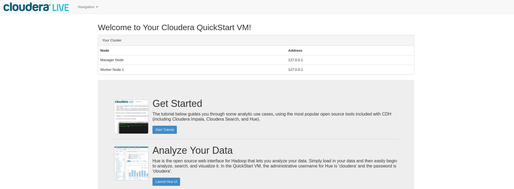

# Installing the Cloudera Hadoop Stack
The course video recommends to install the Cloudera VM. As an alternative, it's also possible to pull Cloudera's Docker image with the equivalent installation of the Hadoop stack:

```shell
$ docker pull cloudera/quickstart
```

Start the Docker container by issuing:

```shell
$ docker run --hostname=quickstart.cloudera --privileged=true -p 8888:8888 -p 9000:80 -it --rm --name cloudera cloudera/quickstart /usr/bin/docker-quickstart
```

Here's a quick explanation of the above Docker command:
* The option `--hostname=quickstart.cloudera` is required because the pseudo-distributed configuration assumes this hostname. * Various tools in the Hadoop stack (HBase, Hive, Hue, Oozie, etc.) require the option `--privileged=true`. 
* The `-p 8888:8888` option maps the port 8888 on the host machine to the Hue port 8888 in the Docker container (Cloudera's [DockerHub documentation](https://hub.docker.com/r/cloudera/quickstart) recommends to use this option). 
* `-p 9000:80` maps the host port 9000 to the container port 80, thereby giving you access to a guided tour which is also shown in the MOOCs week 1 video "Exploring the Cloudera VM: Hands-On Part 1". 
* `--rm` automatically removes the container after exit.
* `-it` makes the container run in the interactive mode and passes the control to the terminal.
* `/usr/bin/docker-quickstart` starts all CDH services (to start services manually, run `/bin/bash` instead).

Optionally, you can also map other ports from Cloudera's container. For instance, port 7180 gives you access to the Cloudera Manager.

# Accessing the Getting Started Tutorial
To access the tutorial, fire up your web browser and navigate to `http://127.0.0.1:9000`. You should see this:



Follow the tutorial steps from here.


